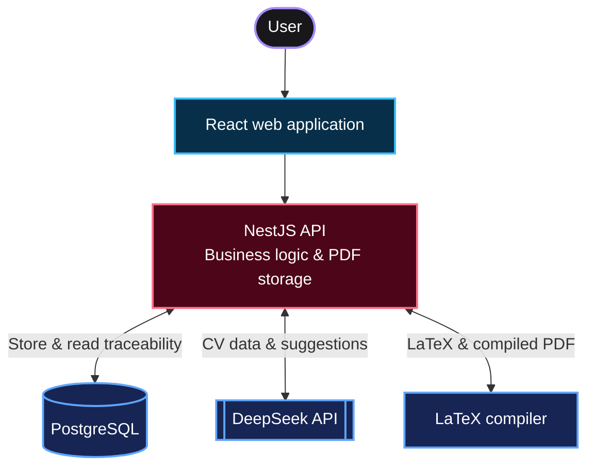

<div align="center">

# DevCareer

### Track every application. Match your CV to each job with AI suggestions—without compromising the truth.

DevCareer tracks each application and compares its job description with your current CV. DeepSeek identifies matches, gaps, and possible wording improvements; you review the result and decide which CV to use.


</div>

## What DevCareer does

DevCareer keeps the vacancy, status timeline, CV-analysis history, and selected resume connected. It shows how the current CV matches a job offer and keeps unsupported requirements visible as gaps instead of turning them into false claims.

DeepSeek provides suggestions only. Application rules validate those suggestions, and the user makes the final decision.

## Application tracking and traceability

```mermaid
flowchart LR
    subgraph Track["1 · TRACK"]
        direction TB
        Job["Job offer"]
        Application["Create application"]
        Timeline["Track status timeline"]
        Job --> Application --> Timeline
    end

    subgraph Match["2 · MATCH"]
        direction TB
        Context["Job description<br/>+ master CV"]
        Suggestions["DeepSeek<br/>matches · gaps · suggestions"]
        Checks["Validate suggestions<br/>against CV evidence"]
        Context --> Suggestions --> Checks
    end

    subgraph Decide["3 · DECIDE"]
        direction TB
        History["Save analysis history"]
        Review["Review the result"]
        Selected["Select the final CV"]
        History --> Review --> Selected
    end

    Track -->|"Analyze CV"| Match
    Match -->|"Save result"| Decide

    classDef track fill:#082f49,stroke:#38bdf8,color:#ffffff,stroke-width:2px;
    classDef match fill:#312e81,stroke:#a78bfa,color:#ffffff,stroke-width:2px;
    classDef decide fill:#422006,stroke:#facc15,color:#ffffff,stroke-width:2px;

    class Job,Application,Timeline track;
    class Context,Suggestions,Checks match;
    class History,Review,Selected decide;

    style Track fill:#020617,stroke:#38bdf8,stroke-width:2px;
    style Match fill:#020617,stroke:#a78bfa,stroke-width:2px;
    style Decide fill:#020617,stroke:#facc15,stroke-width:2px;
```



For every application, DevCareer preserves:

- The current status and complete status timeline.
- The job description used for CV matching.
- The resume version used in each analysis.
- The matches, gaps, warnings, and suggestions returned by DeepSeek.
- The generated CV selected for the application.

## How to use DevCareer

1. Open **Master CV** and upload your complete LaTeX `.tex` resume.
2. Open **Applications** and create an application with the company, job title, and job description.
3. Open the application and generate a CV analysis. DevCareer compares the job description with your current master CV.
4. Review the matched keywords, missing requirements, warnings, and suggested changes.
5. Download the generated `.tex` or PDF and select the analysis you want to use for that application.

> [!IMPORTANT]
> DeepSeek generates suggestions, not facts. Always review the result before using the generated CV.

## Architecture



The browser talks only to the NestJS API. The API stores application history in PostgreSQL, requests CV suggestions from DeepSeek, sends validated LaTeX to the compiler, and stores successful PDFs locally.

## Run locally

### Requirements

- Node.js 22 or a newer compatible LTS release.
- npm.
- Docker with Docker Compose.
- A DeepSeek API key.

> [!IMPORTANT]
> `DEEPSEEK_API_KEY` is indispensable for DevCareer's core CV-matching workflow. The tracker can start without it, but it cannot generate a new CV analysis.

### 1. Configure the DeepSeek API key

Create the local API environment file:

```bash
cp api/.env.example api/.env
```

Open `api/.env` and set your key:

```dotenv
DEEPSEEK_API_KEY=your_api_key_here
```

The key remains in the backend environment and is never sent to the browser. Never commit `api/.env`.

### 2. Start PostgreSQL and the LaTeX compiler

From the repository root:

```bash
docker compose up -d db latex-compiler
```

The first compiler build can take several minutes. Check that both services are ready:

```bash
docker compose ps
```

### 3. Install dependencies and prepare the database

```bash
cd api
npm ci
npx prisma generate
npx prisma migrate deploy
cd ../web
npm ci
cd ..
```

### 4. Start DevCareer

Start the API in one terminal:

```bash
cd api
npm run start:dev
```

Start the web application in another terminal:

```bash
cd web
npm run dev
```

Open **http://localhost:5173**.

To stop the local services without deleting the PostgreSQL volume:

```bash
docker compose down
```
