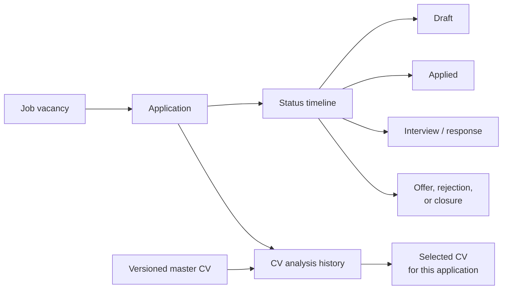
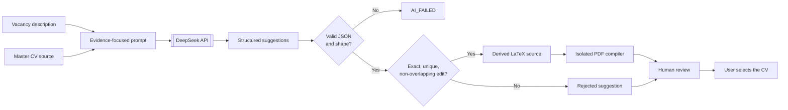

<div align="center">

# DevCareer

### Track every application. Protect the truth in your resume.

DevCareer connects job-application traceability with evidence-based CV suggestions. It helps you understand where every application stands and adapt your resume without presenting invented experience as fact.


</div>

## Three promises

| Track every application | Preserve resume truth | DeepSeek suggests |
| --- | --- | --- |
| Keep the vacancy, current status, complete status timeline, CV-analysis history, and selected CV connected. | Start from a versioned master resume and keep unsupported vacancy requirements visible as gaps—not invented achievements. | DeepSeek proposes structured improvements. Application rules validate the response, and the user reviews the result before selecting it. |

## 1. Application tracking and traceability

An application is not just a row with a status. DevCareer preserves the path from the original vacancy to every status change and every generated CV analysis.



This makes the important questions easy to answer:

- What is the current state of this application?
- How and when did it reach that state?
- Which resume version was analyzed?
- What did each analysis recommend?
- Which generated CV was finally selected?

## 2. The resume stays grounded in evidence

DevCareer is designed to improve wording without turning missing experience into fictional experience.

- The master LaTeX resume is the source of truth.
- Resume uploads create or reuse content-addressed versions instead of silently replacing previous content.
- The AI prompt forbids invented skills, employment, education, dates, achievements, and metrics.
- Unsupported vacancy requirements must be reported as missing keywords or warnings.
- Every suggested edit must identify an exact fragment from the stored resume.
- Deterministic code rejects missing, duplicated, identical, or overlapping replacements.
- Applied and rejected suggestions remain visible for review.

> [!IMPORTANT]
> No language model can mathematically guarantee factual correctness. DevCareer adds evidence-preserving guardrails and keeps the final result reviewable; the user remains responsible for confirming every claim before selecting or sending a CV.

## 3. DeepSeek suggests—the application decides

DeepSeek does not write files, update the database, compile PDFs, or select a CV. It returns suggestions through a narrow provider boundary. DevCareer controls everything that happens afterward.



### What crosses the DeepSeek boundary

| DeepSeek receives | DeepSeek returns | DeepSeek never controls |
| --- | --- | --- |
| Company, job title, vacancy description, and selected resume source | Spanish summary, matched keywords, missing keywords, warnings, and proposed replacements | Database writes, replacement acceptance, LaTeX compilation, PDF storage, or CV selection |

The backend uses an OpenAI-compatible client configured for DeepSeek. The provider is replaceable because the application workflow depends on a `CvAnalysisProvider` contract rather than directly on the vendor SDK.

The response is requested as JSON and parsed as untrusted data. Empty output, invalid JSON, or an invalid structure produces an `AI_FAILED` analysis. Valid suggestions still pass through the deterministic replacement engine before the derived source is compiled.

The DeepSeek API key stays in the backend environment and is never sent to the browser. Generating an analysis does send the vacancy description and resume source to DeepSeek, so users should review DeepSeek's data policies before processing sensitive information.

## Architecture at a glance

| Component | Responsibility | Local address |
| --- | --- | --- |
| React web application | Application management, timelines, analysis review, and CV selection | `http://localhost:5173` |
| NestJS API | Validation, business workflows, DeepSeek orchestration, and persistence | `http://localhost:3000/api` |
| PostgreSQL | Applications, timeline events, resume versions, and analyses | `localhost:5432` |
| LaTeX service | Constrained LaTeX-to-PDF compilation and one-page validation | `http://localhost:3001` |

The browser communicates only with the API. Database credentials, the DeepSeek key, compilation, and generated PDF storage remain behind the backend boundary.

## Run locally

### Requirements

- Node.js 22 or a newer compatible LTS release.
- npm.
- Docker with Docker Compose.
- A DeepSeek API key for generating new analyses.

### 1. Start PostgreSQL and the compiler

From the repository root:

```bash
docker compose up -d db latex-compiler
docker compose ps
```

The first compiler build can take several minutes. Wait until `latex-compiler` reports `healthy`.

### 2. Configure the API

```bash
cp api/.env.example api/.env
```

Add your key to `api/.env` when you want to generate analyses:

```dotenv
DEEPSEEK_API_KEY=your_api_key_here
```

The local `.env` file is ignored by Git and must never be committed.

| Variable | Required | Purpose |
| --- | --- | --- |
| `DATABASE_URL` | Yes | PostgreSQL connection used by Prisma. |
| `PORT` | No | API port; defaults to `3000`. |
| `DEEPSEEK_API_KEY` | For new analyses | Authenticates server-side DeepSeek requests. |
| `DEEPSEEK_MODEL` | No | Selects the DeepSeek model. |
| `LATEX_COMPILER_URL` | No | Configures the compiler address. |
| `LATEX_COMPILER_TIMEOUT_MS` | No | Limits how long the API waits for compilation. |

### 3. Install dependencies and prepare the database

```bash
cd api
npm ci
npx prisma generate
npx prisma migrate deploy
cd ../web
npm ci
cd ..
```

### 4. Optionally load demonstration data

> [!WARNING]
> The seed deletes existing application, timeline, analysis, and resume records before inserting sample data. Run it only against a development database whose contents you can replace.

```bash
cd api
npm run seed
cd ..
```

### 5. Start DevCareer

API terminal:

```bash
cd api
npm run start:dev
```

Web terminal:

```bash
cd web
npm run dev
```

Open **http://localhost:5173**.

## Quality checks

API:

```bash
cd api
npm run format:check
npm run lint
npm run build
```

Web:

```bash
cd web
npm run lint
npm run build
```

Compiler health check:

```bash
curl http://localhost:3001/health
```

Expected response:

```json
{"status":"ok"}
```

Stop the local infrastructure without deleting the PostgreSQL volume:

```bash
docker compose down
```
